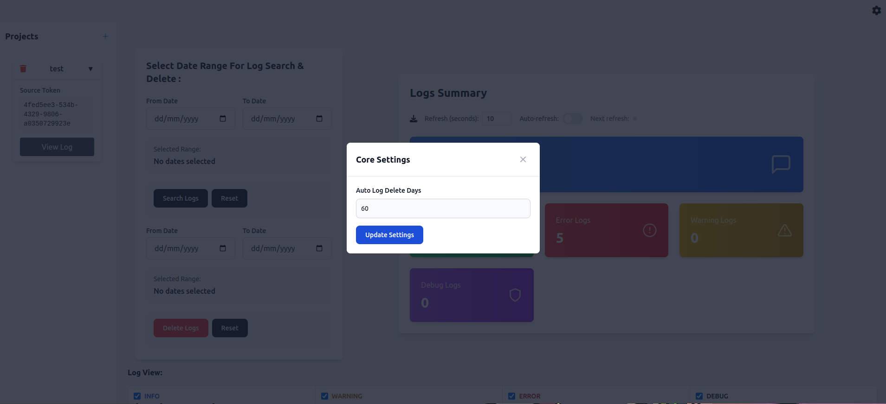
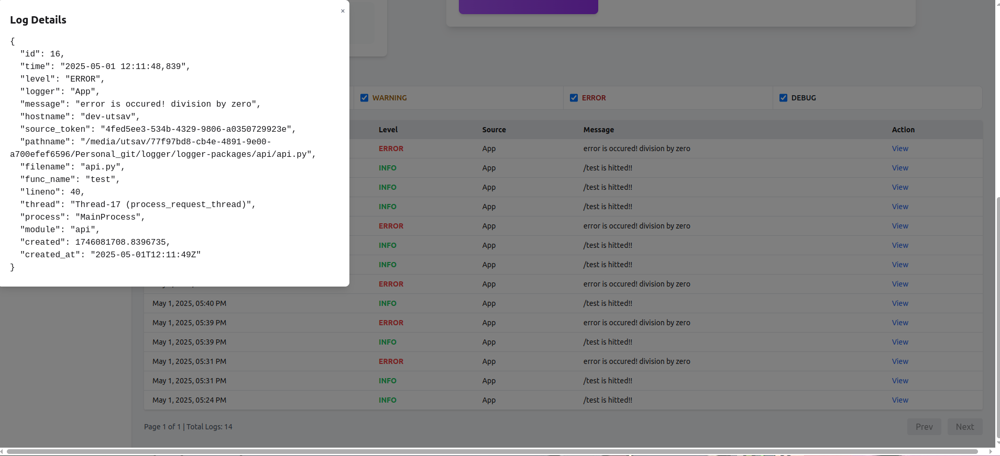

# LogView is a local log manager for your application [continuously updating]

## How to run :
### 1. Run without docker
1. make run-server
2. make run-worker

### 2. Run with docker
1. docker-compose up --build -d [for first time.]
2. docker-compose up -d [if there has no changes in local codebase or image already exists.]

## Things to remember : 
1. LogView depends on redis as message broker . In case of docker all things will be containerized automatically.
2. LogView used mysql database to manage data. For docker build all things will be installed.

### Some Snaps : 

